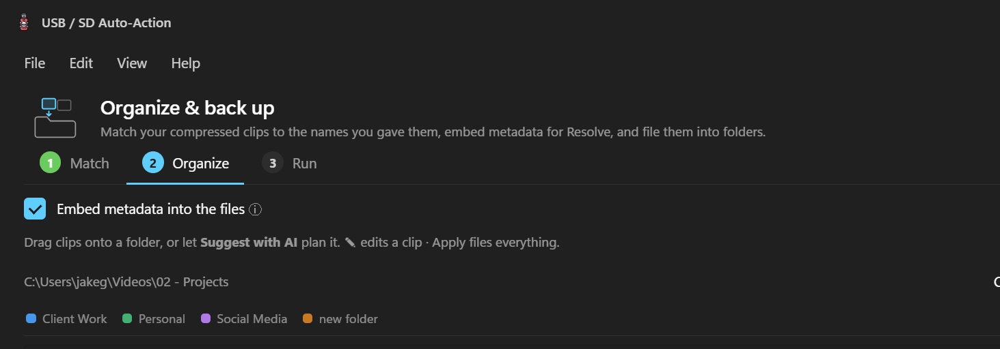

# USB / SD Auto-Action

**A Windows desktop app for videographers that turns a memory card full of footage into named, tagged, face-recognised, organised project folders — fully offline.**

Insert an SD card or plug in a phone, and the app walks your footage through the whole pipeline: **import → rename → (compress) → analyze with local AI → organize into your Projects tree → embed metadata → clear the card.** Every "AI" feature runs locally (Ollama vision models + bundled face recognition) — your frames never leave the machine.



> ℹ️ More screenshots live in [`docs/screenshots/`](docs/screenshots/). Add your own (drag a PNG in and reference it here) — see [Screenshots](#screenshots).

---

## Table of contents

- [What it does](#what-it-does)
- [Download & install](#download--install)
- [Requirements](#requirements)
- [The workflow, step by step](#the-workflow-step-by-step)
- [Local AI (Ollama) setup](#local-ai-ollama-setup)
- [Face recognition](#face-recognition)
- [Build from source](#build-from-source)
- [Configuration](#configuration)
- [Project layout / architecture](#project-layout--architecture)
- [Contributing](#contributing)
- [Roadmap & known limitations](#roadmap--known-limitations)
- [License](#license)

---

## What it does

| Area | Feature |
|------|---------|
| **Import** | Auto-detects USB/SD insertion (global hotkey `Ctrl+Alt+U` or tray icon). Lists every removable drive **and** connected phone (MTP) on the home screen. |
| **Rename** | Batch-rename clips to `date_subject_description_v#`. Reads the real capture date from each file. Multi-select + apply-to-all. |
| **Copy** | Copies renamed clips to your intake folder with a **checksum verify before delete** (sampled SHA-256), optional **NAS mirror** with verify/resume, and duplicate / already-imported detection. |
| **Compress** | Built-in ffmpeg transcode (H.264 / H.265 presets) **or** a hands-off "external watch-folder" mode (e.g. [Tdarr](https://tdarr.io)) — chosen in a setting, so the app never hogs your CPU if a server already handles it. |
| **Analyze (local AI)** | One **✨ Analyze** button: scans faces → you confirm who's who (or turn on 🤖 Auto-faces) → then a local vision model describes every clip and writes a real **subject, description, shot-type and tags**. Improves names you already gave instead of overwriting. Works on **photos** too. |
| **Faces** | Local face recognition (bundled models, WebGL). Recognised faces are **suggestions you confirm** — never silently auto-applied. Confirming trains the person for next time and writes `XMP-iptcExt:PersonInImage` into the file. |
| **Organize** | A live **destination map** of where every clip will be filed in your Projects tree. Discover & continue each project's existing day-folder scheme. **🎬 Sort with me** — a guided, watch-a-clip-and-tell-it-where-it-goes chat that **learns a filing rule** so it stops guessing. |
| **Metadata** | Embeds rich XMP/IPTC (Title, Description, flat keywords, `lr:HierarchicalSubject` for digiKam/Lightroom, date, location, people, shot type) via ExifTool. Writes a DaVinci Resolve metadata CSV. |
| **Safety** | Verify-before-delete, undo/move-log for filing, crash-safe drafts, a session activity log (Help → Activity log) surfacing any silent failures. |
| **Speed** | ⚡ Quick mode: one fast vision call per **subject** (copied to siblings) instead of per clip — turns a multi-hour batch into minutes. Resumable analysis. |

Everything is **offline**. The only network use is talking to your own local Ollama instance (default `http://localhost:11434`).

---

## Download & install

1. Go to the **[Releases](../../releases)** page.
2. Download the latest `USB SD Auto-Action Setup x.y.z.exe`.
3. Run it. It's a per-user NSIS installer (no admin required); you can change the install directory.
4. Launch **USB SD Auto-Action**. First run, open **Edit → Settings** to point your **intake folder** and **Projects root** wherever you like (sensible defaults are created under your `Videos` folder).

> The installer is unsigned, so SmartScreen may warn the first time — click **More info → Run anyway**.

---

## Requirements

- **Windows 10 / 11** (64-bit).
- **[ffmpeg](https://ffmpeg.org/) + ffprobe** on your `PATH` (used for thumbnails, frame sampling, and in-app compression). `winget install Gyan.FFmpeg.Essentials` works. The path is configurable in Settings.
- **Optional — [Ollama](https://ollama.com/)** for the AI naming/description features. Without it, every non-AI feature still works; AI buttons just stay off.
- A vision model pulled in Ollama, e.g. `ollama pull qwen2.5vl`.

---

## The workflow, step by step

1. **Insert a card / connect a phone.** The home screen lists drives & phones. Pick one.
2. **Rename** (Step 1): give each clip (or a batch) a subject + description. Right-click → AI → *Analyze selected clips* to have the local model do it (and scan faces in the same pass).
3. **Copy** (Step 2): clips are verified-copied to your intake folder. Optionally mirror to a NAS.
4. **Clear card** (Step 3): only after copies are verified.
5. **Compress**: either let the app do it (ffmpeg presets) or drop into your watch-folder tool.
6. **Organize**: open *Organize & back up*, point it at your Compressed folder, **Analyze** (faces + names + tags, photos included), then file everything into your Projects tree with embedded metadata. Use **🎬 Sort with me** to teach placement rules.

---

## Local AI (Ollama) setup

1. Install [Ollama](https://ollama.com/) and start it (it serves `http://localhost:11434`).
2. Pull a vision model: `ollama pull qwen2.5vl` (recommended) — or use the in-app **Edit → AI → Models — browse & download…**.
3. In **Edit → AI → AI settings…**, enable AI and pick your model. Optionally set a separate text/reasoning model.
4. Hit **✨ Analyze**. Frames are sampled locally into a contact sheet and sent only to your local Ollama.

**Tuning:** number of frames per clip, temperature, custom guidance prompt, multi-pass reasoning, and learned "memories" (filing/naming preferences) are all in AI settings. The app learns from your edits.

---

## Face recognition

- Models are **bundled** with the app (`src/face-models/`) and run locally via [`@vladmandic/face-api`](https://github.com/vladmandic/face-api) on WebGL — no setup, no downloads, no cloud.
- A scan finds faces, **suggests** matches to people you've named, and you confirm/correct them in the Review-faces grid (type a name or tap a suggestion).
- Confirming grows that person's training set and tags the clip's metadata (`PersonInImage` + a `People/<name>` keyword branch for digiKam/Lightroom).

---

## Build from source

```bash
git clone https://gitea-gour.jakegour.com/liamgour/USB-Video-Downloader.git
cd USB-Video-Downloader
npm install
npm start          # run in dev
npm run dist       # build the Windows NSIS installer into dist/
```

- Electron 42, Node 20+.
- `npm run dist` produces `dist/USB SD Auto-Action Setup x.y.z.exe`.
- ExifTool ships via `exiftool-vendored` and is auto-unpacked from the asar (see `build.asarUnpack` in `package.json`).
- Face-recognition weights live in `src/face-models/` and are bundled by `build.files`.

> **Heads-up:** `electron-builder`'s `winCodeSign` step can fail on a symlink permission error on some Windows setups — see the build notes in [`AGENTS.md`](AGENTS.md).

---

## Configuration

User settings persist to `%APPDATA%\USB SD Auto-Action\config.json` (created on first run; **not** committed). The bundled `config.json` only holds machine-independent defaults (ffmpeg path, hotkey, video extensions). Key things you'll set in **Edit → Settings**:

- **Intake folder** — where renamed clips are copied (default: `…\Videos\USB Auto-Action\01 - Uncompressed`).
- **Projects root** — the tree clips are organised into.
- **Compressed folder** — where compressed clips land / are scanned from.
- **NAS folder**, **compression mode** (app vs external), **AI model**, **ffmpeg path**, hotkey, and more.

---

## Project layout / architecture

```
USB-Video-Downloader/
├─ main.js          # Electron main process: IPC, ffmpeg, ExifTool, Ollama HTTP, MTP/phone, copy/verify, finalize
├─ preload.js       # contextBridge — the typed window.api surface the renderer uses
├─ src/
│  ├─ index.html    # app shell (titlebar, menu bar, step flow, modals)
│  ├─ renderer.js   # ~all UI logic: rename grid, AI flows, destination map, faces, task bar/theater
│  ├─ styles.css    # native dark Fluent styling
│  ├─ face-api.min.js + face-models/   # bundled local face recognition
│  └─ assets/       # icons
├─ config.json      # bundled machine-independent defaults
├─ build/           # app icon
├─ package.json     # electron-builder config (NSIS, per-user)
├─ AGENTS.md        # ⭐ living dev log + conventions — READ THIS, and update it every change
├─ CHANGELOG.md     # human-readable change history
└─ CONTRIBUTING.md  # how to work on this repo
```

The renderer talks to the main process exclusively through `window.api` (defined in `preload.js`). Adding a feature usually means: an `ipcMain.handle('thing', …)` in `main.js`, a one-line bridge in `preload.js`, and UI in `renderer.js` + `index.html` + `styles.css`.

---

## Contributing

Please read **[`CONTRIBUTING.md`](CONTRIBUTING.md)** and **[`AGENTS.md`](AGENTS.md)** first.

- Open an **[Issue](../../issues)** to discuss before a large change.
- The **[Wiki](../../wiki)** holds deeper architecture notes and the running design log.
- ⭐ **`AGENTS.md` must be updated on every meaningful change** (it's the project memory — both humans and AI assistants rely on it). This is not optional; treat it like updating the changelog.

### Screenshots

Capture the app window and drop PNGs into `docs/screenshots/`, then reference them in this README. On Windows you can grab the focused app window with the snippet in `CONTRIBUTING.md`.

---

## Roadmap & known limitations

See the **[Issues](../../issues)** tab for the live list. Highlights:

- **Vision models can hallucinate** a subject (describe something that isn't there). The **🎬 Sort with me** flow and manual rename are the human-in-the-loop cure; improving the prompt/model is ongoing.
- **Photos in the Step-1 Rename grid** ("Path B") — photos are fully supported on the **Organize** screen today (tick *Include photos*); pulling them into the rename grid alongside videos is planned.
- **Source-abstraction refactor** — unify the GoPro/SD and phone import paths.

---

## License

[MIT](LICENSE) © USB-Video-Downloader contributors.

Bundled third-party components keep their own licenses (Electron, ffmpeg [external], ExifTool, face-api.js, Ollama models).
